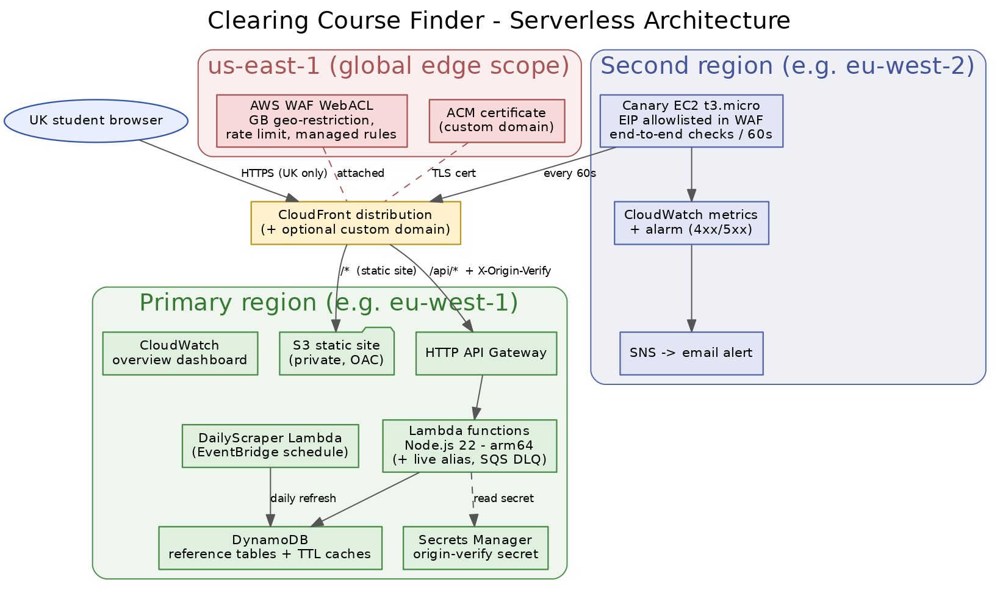
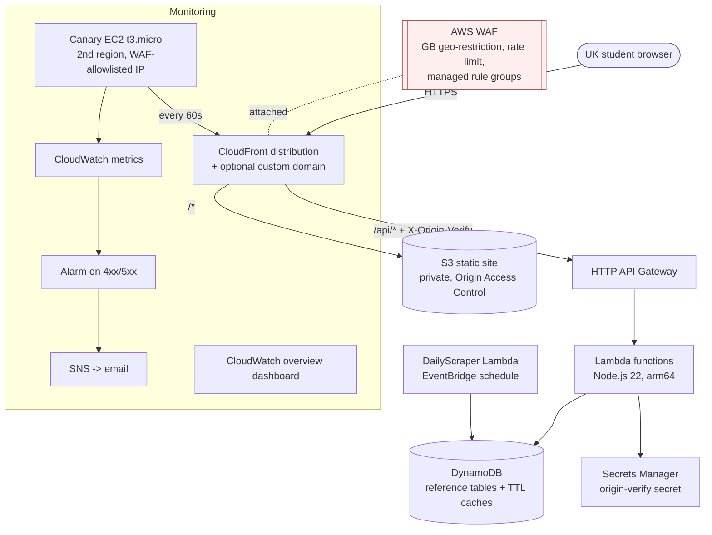

# Architecture & Operations - Clearing Course Finder

A UK-only, fully serverless UCAS Clearing course finder, defined entirely in
Terraform. This document covers the architecture, how to deploy it, how to
destroy it, and the operational controls.

## Architecture diagram



<details><summary>Mermaid source (renders on GitHub)</summary>



</details>

## Regions

| Concern | Region |
|---|---|
| Application, data, API, CDN, canary orchestration | primary region (e.g. eu-west-1) |
| CloudFront-scoped WAF WebACL + ACM certificate | us-east-1 (AWS platform requirement) |
| End-to-end canary EC2 | a second region (e.g. eu-west-2) |

## Components

| Layer | What |
|---|---|
| Edge | CloudFront (GB geo-restriction) + AWS WAF (rate limit, Core Rule Set in block mode, known-bad-inputs, SQLi) |
| Site | Private S3 bucket served via CloudFront Origin Access Control; strong CSP/HSTS response headers |
| API | HTTP API Gateway; the SPA calls `/api/*` same-origin through CloudFront; CloudFront sends an `X-Origin-Verify` header to the API origin |
| Compute | Node.js 22 Lambdas on arm64; a published version + `live` alias; async functions have an SQS dead-letter queue |
| Data | DynamoDB reference tables (PITR) and TTL cache tables; least-privilege per-function IAM scoped to exact table ARNs |
| Secrets | Origin-verify secret generated at deploy time, stored in Secrets Manager |
| Monitoring | Synthetic canary (t3.micro) every 60s, CloudWatch alarm -> SNS email, overview dashboard |
| Optional full scope | CloudWatch observability, Results-Day autoscaling, Grafana analytics |
| Optional custom domain | ACM certificate (us-east-1) + Route 53 alias, off by default |

## Deploy

Prerequisites: Terraform >= 1.5, Python 3, AWS CLI v2, and AWS credentials with
create permissions for the target account.

```bash
# 1. Package the Lambda zips (produces build/<Fn>.zip)
python3 scripts/build_lambdas.py

# 2. Terraform
cd terraform
terraform init -input=false
terraform plan  -input=false -out=plan.out     # review before applying
terraform apply -input=false plan.out

# 3. Publish the static frontend (bucket name is <prefix>-site-<account-id>)
aws s3 sync ../frontend/ s3://<SITE_BUCKET>/ --delete

# 4. Seed reference data into the stack's own tables
AWS_REGION=<region> \
  CONTACTS_TABLE=<prefix>-universities \
  DEFAULTS_TABLE=<prefix>-subject-defaults \
  python3 ../scripts/seed.py
```

Configuration is via `terraform.tfvars` (git-ignored). Useful variables:
`name_prefix`, `enable_full`, `enable_canary`, `waf_crs_count_mode`,
`custom_domain` + `dns_zone_name` (optional), `admin_email` (canary alerts),
`protect_data` (set true in production to enable DynamoDB deletion protection).

Verify from a UK vantage point (the site is GB-only): load the site, run a
search, check `/api/health` returns 200. From a non-UK IP you will correctly
receive the geo-block page.

## Destroy

Deletion protection is off by default (disposable/test posture), so a plain
destroy removes everything:

```bash
cd terraform && terraform destroy      # removes all resources A-Z
# or, with a typed confirmation:
./teardown.sh
```

If `protect_data=true` was set (production), disable it and apply before
destroying, or use `./teardown.sh` which handles it.

## Operational controls (kill switch)

- **Instant, reversible:** disable the CloudFront distribution.
  ```bash
  ./kill.sh --distribution-id <DISTRIBUTION_ID>            # site dark in seconds
  ./kill.sh --distribution-id <DISTRIBUTION_ID> --restore  # bring it back
  ```
- **WAF block (declarative):** `terraform apply -var kill_switch=true` flips the
  WebACL default action to BLOCK.
- **Full teardown:** `./teardown.sh` (see above).

## Accuracy principles

- Show the student's exact UCAS Tariff (letter profile + points) with an in-app
  explanation of the calculation.
- Never display a fabricated course entry requirement; direct students to
  confirm on UCAS or with the university.
- Show only verified figures: graduate prospects with a source link; salary as a
  clearly-labelled national subject median.

## Notes

No account identifiers, domains, or personal data are stored in this repository.
Environment-specific values live only in local, git-ignored files
(`terraform.tfvars`, Terraform state).
